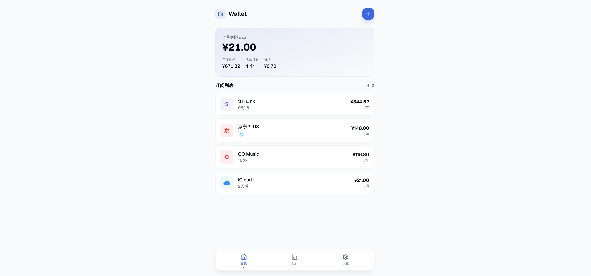

# M-Wallet: 基于 Notion 的订阅追踪与钱包管理

[English](./README.en.md) | 简体中文

基于 Next.js 16 构建的轻量级订阅管理与个人钱包应用。通过 Notion 数据库实时同步你的账单与订阅信息，让你的财务状况一目了然。



## 特性

- **Notion 实时同步**：直接从 Notion 数据库读取订阅数据。
- **订阅管理**：追踪各种服务的订阅费用，支持按月/按年统计。
- **财务概览**：自动计算月度支出、年度余额以及每日平均开销。
- **安全锁定**：支持设置锁定密码，保护你的隐私信息。
- **现代化设计**：基于 Tailwind CSS、Framer Motion 与 Lucide Icons 打造的丝滑 UI/UX。
- **多语言支持**：原生支持中英文切换。

## 安装

由于项目采用 Turborepo 管理的 Monorepo 结构，请按照以下步骤操作：

1. **克隆仓库**：

   ```bash
   git clone https://github.com/busyhe/m-wallet.git
   cd m-wallet
   ```

2. **安装依赖**：

   ```bash
   pnpm install
   ```

3. **配置环境变量**：
   在 `apps/web` 目录下创建 `.env.local` 文件：

   ```bash
   NOTION_TOKEN=your_notion_internal_integration_token
   NOTION_DATABASE_ID=your_notion_database_id
   LOCK_PASSWORD=your_secure_password
   NEXT_PUBLIC_GA_ID=G-XXXXXXXXXX
   NEXT_PUBLIC_LANGUAGE=zh
   ```

   - `NOTION_TOKEN`: 你的 Notion 集成令牌。
   - `NOTION_DATABASE_ID`: 对应数据库的 ID。
   - `LOCK_PASSWORD`: 设置进入应用的访问密码。
   - `NEXT_PUBLIC_LANGUAGE`: 默认语言（`zh` 或 `en`）。

## Notion 数据库结构

1. 复制这个 Notion 模板

   [Notion 演示页面](https://busyhe.notion.site/314bba2b2ae780a09b5ccdbc6fe0bce6?v=314bba2b2ae780b8a9e4000cb5128383&pvs=74)

## 开发与部署

### 本地运行

```bash
pnpm dev
```

### 构建

```bash
pnpm build
```

### 部署

推荐使用 [Vercel](https://vercel.com) 进行一键部署。请确保在 Vercel 面板中配置好所有环境变量。

## 许可证

MIT License
